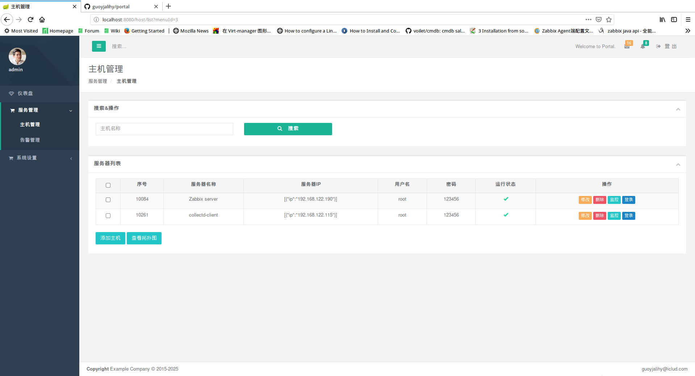
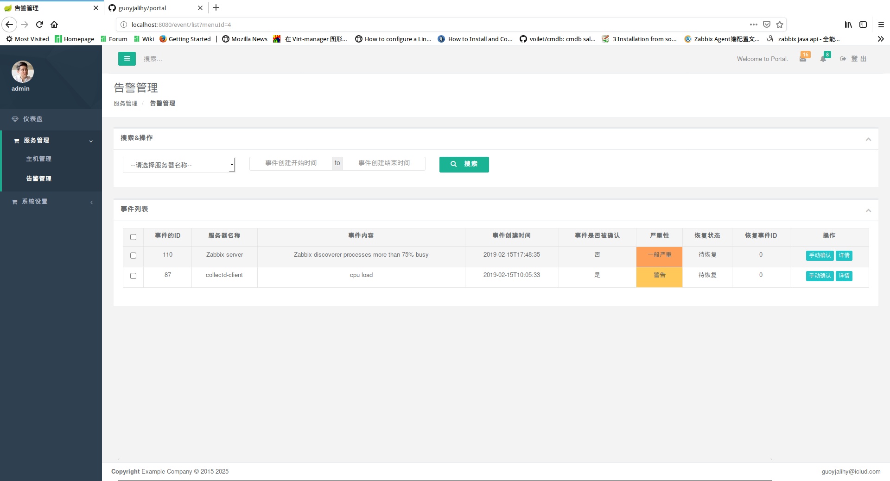
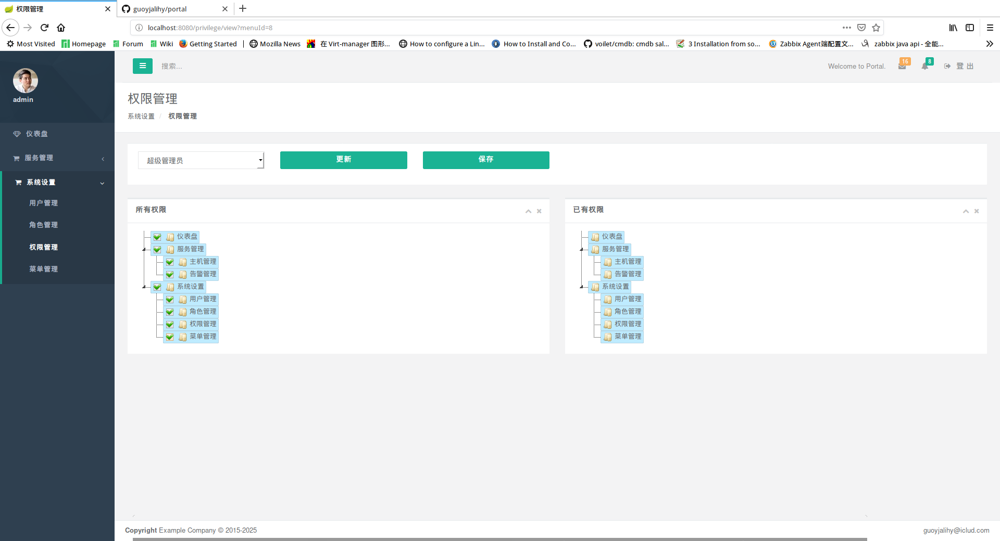

### 通用服务器管理系统

### 使用方式
1. 安装zabbix，参考 https://www.zabbix.com/documentation/3.4/zh/manual/installation/install
2. 安装webssh,参考 https://github.com/huashengdun/webssh
3. 修改application.properties中zabbix.ip=zabbix server的IP
4. 编译运行
5. 访问 localhost:8080  admin/admin 登录